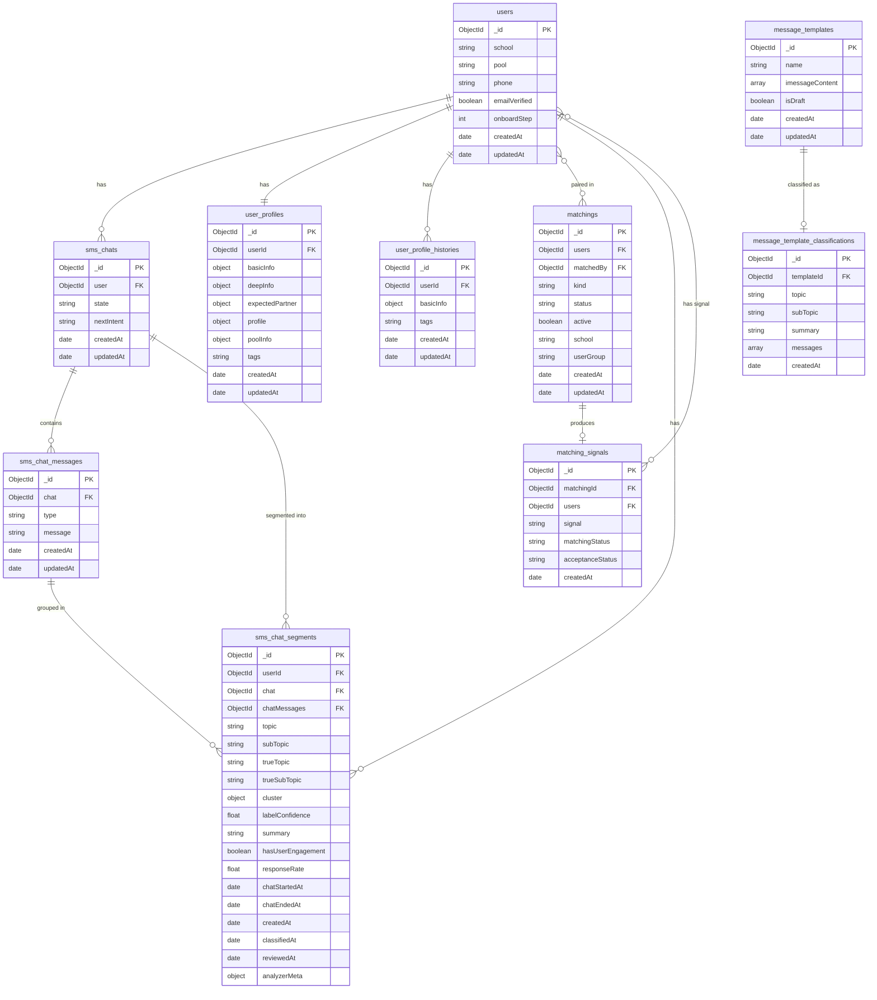

# eb1 — PROD Schema ERD

> Source: `acme` MongoDB Atlas (sampled 2026-02-26).
> Configure collection name mappings in `pipeline/config/analyzer.toml → [collections]`.
>
> **Bold** = read or written by the analysis pipeline (phases 1–3).
> ~~Strikethrough~~ = deprecated (absent from recent PROD documents).

---

## Entity Relationships



---

## Field Reference

### `users` — 84,569 documents

| Field | Type | PK / FK | Coverage | Description |
|---|---|---|---|---|
| **`_id`** | ObjectId | PK | 100% | Unique user identifier |
| `__v` | int | — | 100% | MongoDB internal document version |
| `age` | int | — | 14.4% | User age |
| `consecutivePickTimeFailedCount` | int | — | 81.4% | Rolling count of missed pick-time windows |
| `createdAt` | date | — | 100% | Account creation timestamp |
| `email` | string | — | 57.5% | Email address |
| `emailVerified` | boolean | — | 100% | Whether the email address has been verified |
| `inWaitlist` | boolean | — | 41.6% | User is in the active waitlist |
| `onboardStep` | int | — | 100% | Current onboarding step (integer enum) |
| `onboardStep2` | string | — | 100% | Secondary onboarding state (string enum) |
| `phone` | string | — | 88.0% | Phone number |
| `phoneVerified` | boolean | — | 98.5% | Whether phone number has been verified |
| `pool` | string[] | — | 100% | Clubs / activity pools the user belongs to |
| `ref` | string | — | 98.5% | Referral source code |
| `school` | string | — | 100% | University affiliation (e.g. CAL, UCSD, USC) |
| `updatedAt` | date | — | 100% | Last document update timestamp |
| `vibeCheckSent` | boolean | — | 96.5% | Whether an initial vibe-check message has been sent |
| ~~`accountStatus`~~ | string | — | 1.1% | Legacy account state enum |
| ~~`googleId`~~ | string | — | 1.1% | Google OAuth identifier |
| ~~`lastLoginAt`~~ | date | — | 1.3% | Last login timestamp |
| ~~`lastLoginIp`~~ | string | — | 73.9% | Last login IP address |
| ~~`name`~~ | string | — | 1.1% | Display name (superseded by `user_profiles`) |

---

### `user_profiles` — 72,028 documents

| Field | Type | PK / FK | Coverage | Description |
|---|---|---|---|---|
| `_id` | ObjectId | PK | 100% | Unique profile identifier |
| `__v` | int | — | 100% | MongoDB internal document version |
| `age` | int | — | 16.7% | User age |
| `AIPickProfilesHistory` | array | — | 99.5% | History of AI-curated profile picks shown to the user |
| `basicInfo` | object | — | 100% | Core profile data: gender, ethnicity, MBTI, height, birthday, etc. |
| `createdAt` | date | — | 100% | Profile creation timestamp |
| `datingImages` | array | — | 99.5% | Dating-context photo references |
| `deepInfo` | object | — | 91.8% | Personality data: intentions, beliefs, traits, green/red flags |
| `expectedPartner` | object | — | 86.6% | Partner preference settings |
| `idealDateImages` | array | — | 100% | Ideal date scenario image references |
| `images` | ObjectId[] | FK[] | 100% | Profile photo references |
| `isAnalyzing` | boolean | — | 92.6% | AI analysis job is currently in progress |
| `issues` | array | — | 87.4% | Active profile quality issues flagged by the system |
| `poolInfo` | object | — | 82.5% | Pool-specific profile metadata |
| `profile` | object | — | 87.3% | Narrative profile text and structured summary |
| `tags` | string[] | — | 99.4% | AI-generated descriptive tags for the profile |
| `updatedAt` | date | — | 100% | Last document update timestamp |
| `userId` | ObjectId | FK → users._id | 100% | Owner user reference |
| ~~`identityScale`~~ | object[] | — | 1.3% | Legacy identity spectrum data |
| ~~`note`~~ | string | — | 0.7% | Internal admin note (superseded by `issues`) |

---

### `user_profile_histories` — 408,354 documents

| Field | Type | PK / FK | Coverage | Description |
|---|---|---|---|---|
| `_id` | ObjectId | PK | 100% | Unique snapshot identifier |
| `__v` | int | — | 100% | MongoDB internal document version |
| `age` | int | — | 47.4% | User age at time of snapshot |
| `AIPickProfilesHistory` | array | — | 100% | AI-curated picks history at time of snapshot |
| `basicInfo` | object | — | 97.0% | Core profile data at time of snapshot |
| `createdAt` | date | — | 100% | Original profile creation timestamp |
| `datingImages` | array | — | 100% | Dating photo references at time of snapshot |
| `deepInfo` | object | — | 30.5% | Personality data at time of snapshot (declining) |
| `images` | ObjectId[] | FK[] | 100% | Profile photo references at time of snapshot |
| `tags` | string[] | — | 100% | AI-generated tags at time of snapshot |
| `updatedAt` | date | — | 100% | Snapshot write timestamp |
| `userId` | ObjectId | FK → users._id | 100% | Owner user reference |
| ~~`expectedPartner`~~ | object | — | 4.9% | Partner preferences (moved to `user_profiles` only) |
| ~~`identityScale`~~ | object[] | — | 1.0% | Legacy identity spectrum data |
| ~~`note`~~ | string | — | 0.8% | Internal admin note |
| ~~`profile`~~ | object | — | 4.7% | Narrative profile (moved to `user_profiles` only) |

---

### `matchings` — 5,460 documents

| Field | Type | PK / FK | Coverage | Description |
|---|---|---|---|---|
| `_id` | ObjectId | PK | 100% | Unique matching identifier |
| `__v` | int | — | 100% | MongoDB internal document version |
| `acceptanceStatus` | string[] | — | 100% | Per-user decision array, aligned with `users[]`. Values: `"accepted"`, `"rejected"`, `"schedulerViewed"`, `"schedulerOperated"`, `"cancelled"`, `"deactivated"`, `"paused"`, or `null` (pending). Legacy docs may contain boolean `false`. |
| `active` | boolean | — | 100% | Whether the matching is currently active |
| `createdAt` | date | — | 100% | Matching creation timestamp |
| `dateEnd` | date | — | 15.0% | Scheduled date end time |
| `dateStart` | date | — | 15.0% | Scheduled date start time |
| `feedbackCollected` | array | — | 39.4% | Per-user flag indicating whether post-date feedback was collected |
| `feedbacks` | array | — | 96.6% | Per-user post-date feedback text (null or string per element) |
| `inAutomation` | boolean | — | 78.0% | Matching is managed by the automation system |
| `intros` | array | — | 39.4% | AI-generated introduction messages |
| `isAbTesting` | boolean | — | 22.4% | Matching was part of an A/B test |
| `kind` | string | — | 100% | Match type: `school` or `pool` |
| `matchRating` | string | — | 47.4% | Qualitative match quality rating |
| `matchScore` | float | — | 77.3% | Numeric compatibility score |
| `matchedBy` | ObjectId | FK → users._id | 81.8% | Staff or system user who created the matching |
| `notes` | string | — | 22.7% | Internal staff notes on the matching |
| `pausedAutomation` | boolean | — | 26.4% | Automation is paused for this matching |
| `posterUrls` | string[] | — | 98.8% | Resolved URLs for poster images |
| `posters` | ObjectId[] | FK[] | 97.5% | References to poster image documents |
| `schejEventId` | string | — | 97.0% | External calendar event identifier |
| `school` | string | — | 96.3% | School context for this matching |
| `status` | string | — | 100% | Matching lifecycle stage. Terminal: `ContactExchanged`, `Dated`, `DateCancelled`, `Failed - Refused`, `PickTimeFailed`, `Failed`, `Failed - Expired`. Intermediate: `Matched`, `EmailSent 2/2`, `TimeScheduled 1/2`, `ConfirmationEmailSent 2/2`, `Poster Done`. |
| `tips` | array | — | 99.5% | AI-generated conversation-starter tips |
| `updatedAt` | date | — | 100% | Last document update timestamp |
| `userGroup` | string | — | 95.4% | User cohort group for this matching |
| `users` | ObjectId[] | FK[] → users._id | 100% | Two-element array of matched user IDs |
| ~~`matchedUserId`~~ | ObjectId | FK → users._id | 0.5% | Legacy single-user FK (replaced by `users` array) |
| ~~`pausedReason`~~ | string | — | 0.0% | Legacy pause reason text |
| ~~`userId`~~ | ObjectId | FK → users._id | 0.5% | Legacy single-user FK (replaced by `users` array) |

---

### `sms_chats` — 82,103 documents

| Field | Type | PK / FK | Coverage | Description |
|---|---|---|---|---|
| **`_id`** | ObjectId | PK | 100% | Unique chat session identifier |
| `__v` | int | — | 100% | MongoDB internal document version |
| `createdAt` | date | — | 100% | Chat session creation timestamp |
| `acmeNumber` | string | — | 89.3% | Acme's phone number assigned to this session |
| `hasPendingResponse` | boolean | — | 90.2% | Whether the AI has an outbound message queued |
| `lastMessageTime` | date | — | 84.8% | Timestamp of the most recent message in the session |
| `nextIntent` | string | — | 99.0% | State-machine intent driving the next AI response |
| `pauseAIReply` | boolean | — | 80.7% | When true, AI responses are suppressed |
| `phone` | string | — | 88.1% | User's phone number |
| `shortSignupCode` | string | — | 19.5% | Short-link signup code used at onboarding |
| `state` | string | — | 100% | Current state-machine state (e.g. `iMessage`, `sms`) |
| `switchToSmsAttempts` | int | — | 21.0% | Number of times the system tried to migrate to SMS |
| `unreadCount` | int | — | 100% | Number of unread messages in this session |
| `updatedAt` | date | — | 100% | Last document update timestamp |
| **`user`** | ObjectId | FK → users._id | 98.5% | Owner user reference |
| `isShortSignup` | boolean | — | 19.5% | Whether session was created via short-link signup flow |
| ~~`iMessageEmail`~~ | string | — | 1.8% | Legacy iMessage email routing address |

---

### `sms_chat_messages` — 1,108,707 documents

| Field | Type | PK / FK | Coverage | Description |
|---|---|---|---|---|
| **`_id`** | ObjectId | PK | 100% | Unique message identifier |
| `__v` | int | — | 93.5% | MongoDB internal document version |
| **`chat`** | ObjectId | FK → sms_chats._id | 100% | Parent chat session reference |
| **`createdAt`** | date | — | 100% | Message send timestamp |
| `isMalicious` | boolean | — | 87.7% | Whether the message was flagged as malicious by the moderation system |
| `isProblematic` | boolean | — | 89.2% | Whether the message was flagged as problematic by the moderation system |
| **`message`** | string | — | 100% | Message text content |
| `messageId` | string | — | 68.9% | External message ID from the SMS/iMessage provider |
| `provider` | string | — | 88.2% | Delivery provider (e.g. `twilio`, `imessage`) |
| **`type`** | string | — | 100% | Sender role: `user` or `assistant`; also `automated`, `system`, `team` for non-conversation messages. Analysis pipeline filters to `user`, `assistant`, `automated`, and `team`. |
| `updatedAt` | date | — | 100% | Last update timestamp |
| ~~`langsmithRunId`~~ | string | — | 1.1% | Legacy LangSmith trace ID |
| ~~`mediaUrl`~~ | string | — | 1.7% | Legacy media attachment URL |

---

### `matching_signals` — local only, written by analysis pipeline

| Field | Type | PK / FK | Coverage | Description |
|---|---|---|---|---|
| **`_id`** | ObjectId | PK | — | Unique signal identifier |
| **`matchingId`** | ObjectId | FK → matchings._id | — | Source matching that produced this signal |
| **`users`** | ObjectId[] | FK[] → users._id | — | Two-element array mirroring `matchings.users` |
| **`signal`** | string[] | — | — | Per-user signal aligned with `users[]`: `"TP"` or `"FP"` |
| **`matchingStatus`** | string | — | — | The matching's `status` that produced this signal (provenance) |
| **`acceptanceStatus`** | string[] | — | — | Raw per-user acceptance values from `matchings.acceptanceStatus` — preserved for FP subcategory analysis |
| **`createdAt`** | date | — | — | Matching creation timestamp (for temporal correlation with `sms_chat_segments`) |

---

### `sms_chat_segments` — local only, written by analysis pipeline

| Field | Type | PK / FK | Coverage | Description |
|---|---|---|---|---|
| **`_id`** | ObjectId | PK | — | Unique segment identifier |
| **`userId`** | ObjectId | FK → users._id | — | Owner user reference |
| **`chat`** | ObjectId | FK → sms_chats._id | — | Source chat session (matches `sms_chat_messages.chat`) |
| **`chatMessages`** | ObjectId[] | FK[] → sms_chat_messages._id | — | Ordered array of message IDs that make up this segment |
| **`cluster`** | object | — | — | Offline HDBSCAN clustering results. `null` before first offline quality run. Contains: `id` (int, cluster assignment, -1=noise), `confidence` (float [0,1], membership probability), `topic` (string, LLM-assigned centroid topic, null before labeling), `subTopic` (string, LLM-assigned centroid subtopic, null before labeling), `runAt` (date, timestamp of the offline run). |
| **`labelConfidence`** | float | — | — | LLM self-reported confidence [0, 1]. Populated by Analyzer. |
| **`topic`** | string | — | — | AI-assigned primary category from `taxonomy.yaml`. Populated by Analyzer. |
| **`subTopic`** | string | — | — | AI-assigned granular category within the topic. Populated by Analyzer. |
| **`trueTopic`** | string | — | — | Human-verified topic (null until reviewed) |
| **`trueSubTopic`** | string | — | — | Human-verified sub-topic (null until reviewed) |
| **`summary`** | string | — | — | LLM-generated 1–2 sentence summary of the segment's intent, scoped to the assigned topic. Populated by Analyzer. |
| **`reviewedBy`** | string | — | — | Reviewer identifier (null until reviewed) |
| **`sentiment`** | string | — | — | Segment sentiment: `positive`, `negative`, `neutral`, or `mixed`. Populated by Analyzer. |
| **`hasUserEngagement`** | boolean | — | — | `true` when at least one message in the segment has `type == "user"`. Deterministic — computed from message data, not by LLM. |
| **`responseRate`** | float | — | — | Ratio of user responses to substantive bot messages [0.0–1.0]. Computed as `userResponseCount / botPromptCount` from LLM output. Defaults to `0.0` when bot has no substantive messages or LLM omits the counts. |
| **`chatStartedAt`** | date | — | — | Timestamp of the first message in the segment |
| **`chatEndedAt`** | date | — | — | Timestamp of the last message in the segment |
| **`createdAt`** | date | — | — | Segment document creation timestamp |
| **`updatedAt`** | date | — | — | Last update timestamp |
| **`classifiedAt`** | date | — | — | Timestamp when Analyzer wrote topic + confidence signals |
| **`reviewedAt`** | date | — | — | Timestamp when a human reviewed and verified the segment (null until reviewed) |
| **`analyzerMeta`** | object | — | — | LLM provenance: `{model, promptVersion, temperature, runId}`. Written only when `benchmark_mode = true` in config. Enables filtering/deleting docs by LLM run. |

---

### `message_templates` — PROD, read-only by analysis pipeline

| Field | Type | PK / FK | Coverage | Description |
|---|---|---|---|---|
| **`_id`** | ObjectId | PK | 100% | Unique template identifier |
| **`name`** | string | — | — | Human-readable template name |
| **`imessageContent`** | array[object] | — | — | Array of `{message: string, media_url?: string}` objects. Each object is one message in the template sequence. |
| `isDraft` | boolean | — | — | Whether the template is a draft (excluded from classification) |
| `createdAt` | date | — | — | Template creation timestamp |
| `updatedAt` | date | — | — | Last update timestamp |

---

### `message_template_classifications` — local only, written by analysis pipeline

| Field | Type | PK / FK | Coverage | Description |
|---|---|---|---|---|
| **`_id`** | ObjectId | PK | — | Unique classification identifier |
| **`templateId`** | ObjectId | FK → message_templates._id | — | Source template that was classified |
| **`topic`** | string | — | — | Assigned topic from `taxonomy.yaml`. Validated against `INITIAL_TAXONOMY` keys. |
| **`subTopic`** | string | — | — | Assigned sub-topic from `taxonomy.yaml` |
| **`summary`** | string | — | — | LLM-generated one-sentence description of what the template communicates |
| **`messages`** | string[] | — | — | Individual message texts extracted from `imessageContent[].message`. Used by the segmenter's `difflib` matcher for bot-only segment enrichment. |
| **`createdAt`** | date | — | — | Classification timestamp |

---

## Maintenance

### Last updated

**2026-03-26** — added compound index `(analyzerMeta.runId, userId)` on `sms_chat_segments` for single-collection benchmark architecture (all benchmark models share one collection, distinguished by `analyzerMeta.runId`). Previous: 2026-03-24 replaced `clusterConfidence` (float) with `cluster` (object: `{id, confidence, topic, subTopic, runAt}`) for offline HDBSCAN quality layer. 2026-03-22 removed `isNewTopic`/`isNewSubTopic`; added `sms_chat_taxonomy` and `sms_chat_template_taxonomy` collections.

### When to re-run

Re-run this task whenever:
- A new collection is added to PROD
- A new field is confirmed stable (appears in >10% of recent documents)
- A field is suspected to be deprecated (stops appearing in new documents)
- The analysis pipeline reads a new PROD field

### How to re-run

1. **Connect to PROD** — ensure `MONGODB_INPUT_URI` and `MONGODB_INPUT_DB_NAME` are set in `.env`.

2. **Run the introspection script** — paste the script below into a Python REPL or scratch file and execute it. It samples 200 recent documents per collection to compute coverage, and compares recent coverage against overall coverage to flag deprecated fields.

```python
import json
from pymongo import MongoClient
from collections import defaultdict

MONGODB_URI = "<MONGODB_INPUT_URI from .env>"
DB_NAME     = "<MONGODB_INPUT_DB_NAME from .env>"

COLLECTIONS = [
    "users", "user_profiles", "user_profile_histories",
    "matchings", "sms_chats", "sms_chat_messages",
]
SAMPLE_SIZE = 200  # recent documents for deprecation check

client = MongoClient(MONGODB_URI)
db     = client[DB_NAME]
result = {}

for col_name in COLLECTIONS:
    col   = db[col_name]
    total = col.count_documents({})
    if total == 0:
        continue

    # Discover all field names via random sample
    sample = list(col.aggregate([{"$sample": {"size": min(500, total)}}]))
    field_types: dict[str, set] = defaultdict(set)
    for doc in sample:
        for k, v in doc.items():
            t = type(v).__name__
            if isinstance(v, list):
                inner = type(v[0]).__name__ if v else "?"
                t = f"array[{inner}]"
            field_types[k].add(t)

    # Recent sample for deprecation check
    recent = list(col.find({}, limit=SAMPLE_SIZE, sort=[("_id", -1)]))

    fields = {}
    for field, types in field_types.items():
        overall = col.count_documents({field: {"$exists": True}}) / total
        recent_count = sum(1 for d in recent if field in d)
        recent_cov   = recent_count / len(recent) if recent else 0.0
        deprecated   = overall < 0.10 or (recent_cov < 0.10 and overall > 0.30)
        fields[field] = {
            "types":           "/".join(sorted(types)),
            "coverage":        round(overall, 3),
            "recent_coverage": round(recent_cov, 3),
            "deprecated":      deprecated,
        }

    result[col_name] = {"total": total, "fields": fields}

print(json.dumps(result, indent=2, default=str))
```

3. **Update `docs/erd.md`** — using the script output:
   - Add any new fields to the relevant collection table with the `coverage` value formatted as a percentage (e.g. `0.875` → `87.5%`).
   - Update changed coverage values in the Coverage (%) column.
   - Mark fields with `deprecated: true` using ~~strikethrough~~.
   - Remove deprecated markers from fields that are now active again (rare).
   - Update the "Last updated" date and document count above.

4. **Update bold markers** — if the analysis pipeline starts reading a new PROD field, bold it. If a field is no longer read, remove the bold.

---

## Notes

- `matching_signals` stores one document per signal-carrying matching. Only two PROD statuses are collected: `ContactExchanged` (bilateral TP) and `Failed - Refused` (at least one `"rejected"` in `acceptanceStatus`). `users[i]` aligns with `signal[i]` and `acceptanceStatus[i]` — same index pattern as `matchings.users` / `matchings.acceptanceStatus`. Idempotent: drop and regenerate from PROD matchings anytime.
- `sms_chat_segments` is the primary pipeline output; it is written only to the output DB (`MONGODB_OUTPUT_URI`), never to PROD.
- `matchings.users` is a two-element array `[userId_A, userId_B]`. The deprecated `userId` and `matchedUserId` single-FK fields are the old schema.
- `matchings.acceptanceStatus` is index-aligned with `matchings.users` — `acceptanceStatus[0]` is the decision of `users[0]`. Values represent the user's furthest interaction: `null` (never responded) → `"schedulerViewed"` (viewed scheduler) → `"schedulerOperated"` (interacted with scheduler) → `"accepted"` / `"rejected"` / `"cancelled"`. `"deactivated"` and `"paused"` reflect account-level state changes. Legacy documents (~68 entries) contain boolean `false` instead of `"rejected"`.
- `matchings.status` terminal values: `ContactExchanged` (both exchanged contacts), `Dated` (date occurred — `acceptanceStatus` may be stale; status itself is the ground truth), `DateCancelled` (date was scheduled then cancelled), `Failed - Refused` (at least one user rejected), `PickTimeFailed` (scheduling failed — one or both users didn't complete the pick-time flow), `Failed` / `Failed - Expired` (legacy stale states).
- `matchings.status` intermediate values: `Matched` → `EmailSent 2/2` → `TimeScheduled 1/2` → `ConfirmationEmailSent 2/2` → `Poster Done`. These represent in-progress states before a terminal outcome; the analysis pipeline ignores them for sampling.
- `user_profiles` is 1-to-1 with `users` (unique index on `userId`). `user_profile_histories` is the append-only audit log of every past state.
- `sms_chats.user` is the FK to `users._id` — the field name is `user`, not `userId`.
- `sms_chat_messages.chat` references `sms_chats._id` — the field name is `chat`, not `chatId`.
- `sms_chat_messages.type` carries the sender role (`user`/`assistant`) plus operational values (`automated`, `system`, `team`). The analysis pipeline filters to `user`, `assistant`, `automated`, and `team`.
- `sms_chat_segments.chatMessages` holds one or more message IDs from the same chat session. A single message may appear in multiple segments when it covers multiple topics — in that case, each segment's `summary` reflects only the assigned topic, not the full message content.
- `sms_chat_segments.chat` mirrors `sms_chat_messages.chat` — same FK name, same target collection.
- `message_template_classifications` stores one document per classified PROD template. Created by `--classify-templates` (LLM classifies each template's `imessageContent` against `taxonomy.yaml`). The `messages` field stores individual template message strings, used by the segmenter's `difflib.SequenceMatcher` to enrich bot-only segments with topic/subTopic/summary at runtime (no LLM call). Idempotent: skips templates already classified (checks `templateId`).
- MongoDB does not enforce foreign-key constraints; all relationships are application-level conventions.
- Coverage percentages are based on a random sample of 200 recent documents from each collection.
